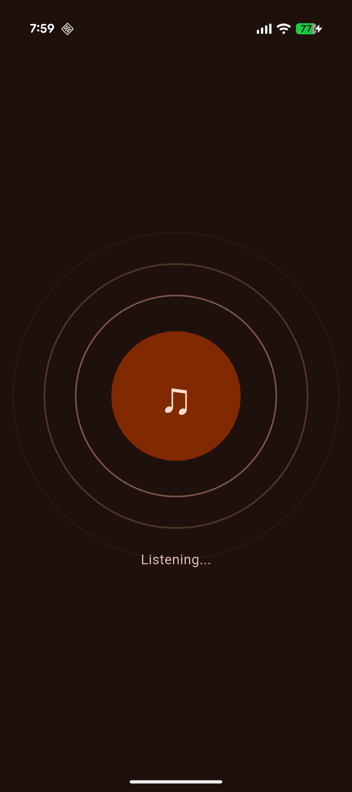
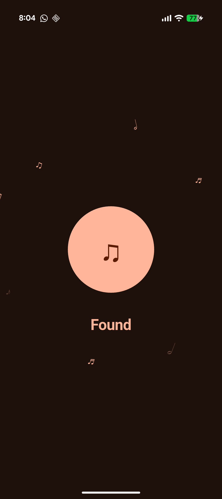
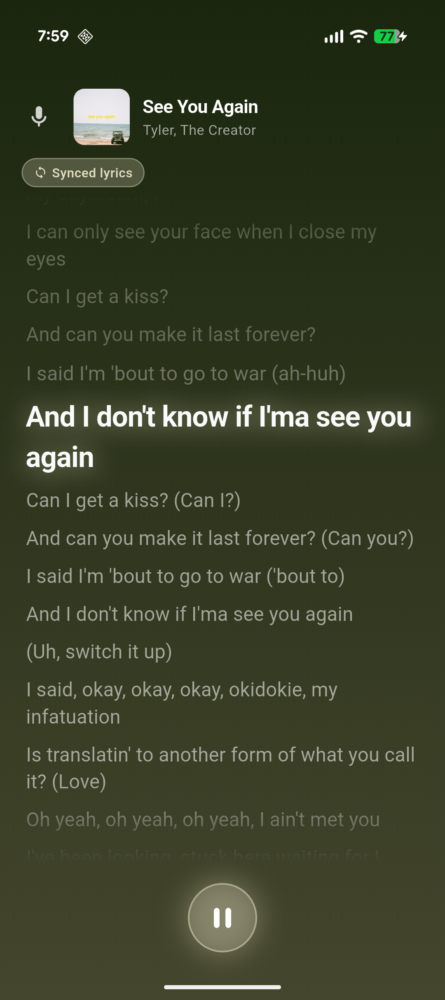

# Synced

A music recognition app that identifies songs and displays synced lyrics.

---

## Features

- Identifies any song playing around you in 6 seconds
- Displays time-synced lyrics that scroll automatically with the song
- Themes the UI dynamically based on the song's album art
- Tap any lyric line to seek the sync to that position
- Accurate sync using wall-clock time — no drift regardless of network speed

---

## Screenshots

| Listening | Found | Lyrics |
|:---------:|:-----:|:------:|
|  |  |  |
